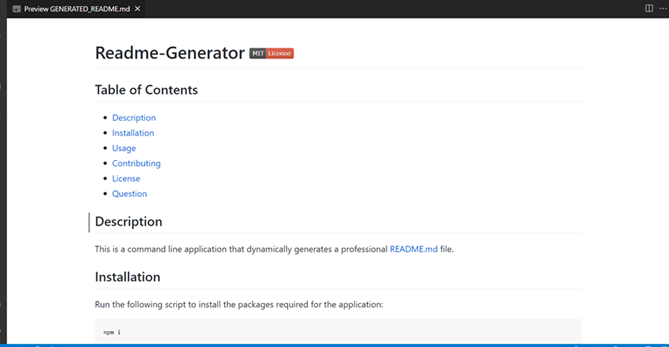
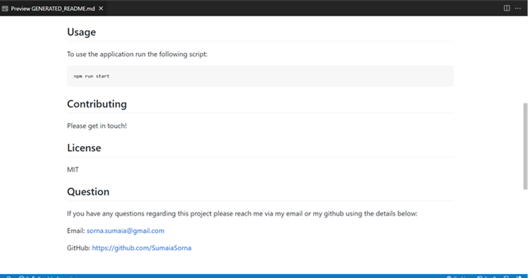

# Readme Generator 


## Deployed URL

Click [here](https://sumaiasorna.github.io/readme-generator-node.js/) to view deployed application on Github page.

## Link to Demo Vedio

<a href="https://drive.google.com/drive/u/0/folders/1Btrfw7xS7A-m06o9i2nxBnDqUijh5KD3">Walkthrough Video</a>

## Table Of Contents

- [Description](#description)
- [Installation](#installation)
- [Deployed URL](#deployed-url)
- [Link to Demo Vedio](#link-to-demo-vedio)
- [Screenshots](#screenshots)

## Description

Readme-generator is an app which I have created using Node.js with the inquirer package.This app accepts user input and returns a README.md file, with sections and table of contents dynamically build based on which elements the user choose to include.

## Installation

```
git clone git@github.com:SumaiaSorna/readme-generator-node.js.git
cd readme-generator-node.js
code .
npm i
```

## Screenshots





## Questions

If you have any questions about this application, please feel free to contact me in my <a href="mailto:sorna.sumaia@gmail.com">email.</a>
